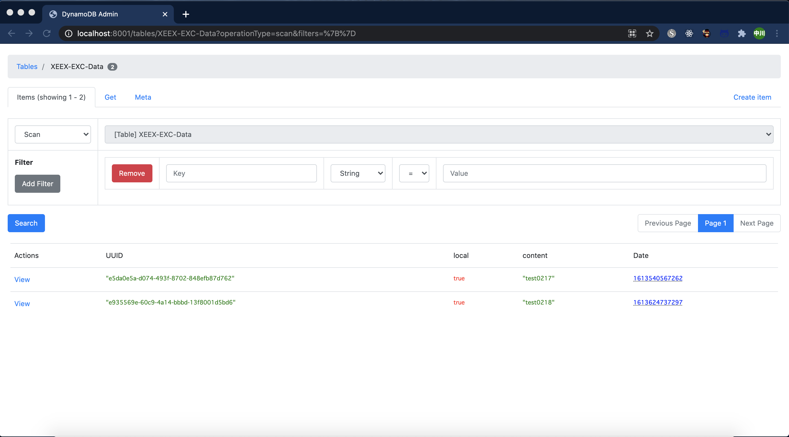

# EX Connect API

EX Connect 用テーブル（DynamoDB）に API 経由でデータ登録・取得プログラム

- db - 各テーブルの定義ファイル
- event - Lambda 実行時に渡すイベント
- lambda - 各テーブルへのデータ処理プログラム
- templete.yaml - Lambda、API Gateway の定義ファイル

## 環境構築手順

1.docker で使用するネットワークを作成（ネットワーク名：XEEX-EXC-Network）

```bash
make docker-net
```

2.DynamoDB-local 用のコンテナ作成（コンテナ名：dynamodb）
※実行後、Ctrl + C で実行停止

```bash
make docker-create
```

3.dynamodb コンテナを実行（バックグラウンド実行）

```bash
make docker-start
```

4.テーブル作成（作成テーブル：例 XEEX-EXC-Data）

```bash
make create table=XEEX-EXC-Data
```

5.ビルド

```bash
make bulld
```

6.Lambda・API ゲートウェイ起動

```bash
make start
```

※テーブル削除（作成テーブル：例 XEEX-EXC-Data）

```bash
make delete table=XEEX-EXC-Data
```

※コンテナ削除

```bash
make clean
```

## DynamoDB 編集・閲覧画面の起動

```bash
npm start
```

【画面イメージ】


